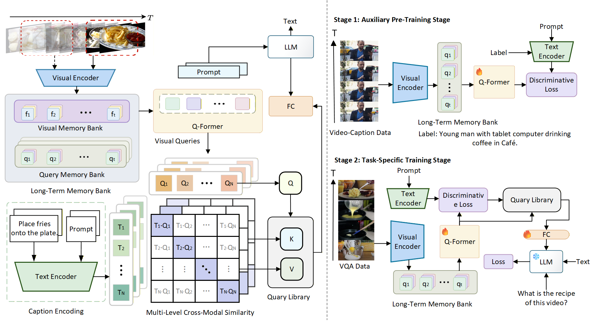

# MMA-MFF: Mitigating Hallucinations in Large Video-Language Models throughMulti-Level Multimodal Alignment and Fusion
The official repository of our paper "**Mitigating Hallucinations in Large Video-Language Models through Multi-Level Multimodal Alignment And Fusion**".

## Model Overview


## Features
1. We propose a novel multi-level multimodal alignment strategy that incorporates textual semantic supervision during visual encoding. This approach aligns semantic features from both text and vision at multiple levels to address hallucinations in large video-language models.
2. We propose a two-stage training strategy that facilitates progressive co-learning from general vision-text semantics to task-specific semantics, utilizing a larger and more diverse dataset.
3. We propose an innovative multi-dimensional feature fusion strategy that introduces a dynamic interaction mechanism into cross-modal representation learning. This approach employs a cross-attention architecture to achieve deep integration of semantically aligned features with original visual features, thereby addressing the modality imbalance problem in video-language models.
4. We conducted extensive experiments on the LVU dataset compare our methods with other VLMs. Our results show that our approach achieves state-of-the-art performance across various downstream video tasks, significantly improving the quality and reliability of video language models while effectively reducing hallucinations.
## Abstract
The recent success of large language models (LLMs) has significantly heightened interest in integrating vision models for the development of vision-language foundation models. These multimodal frameworks are designed to combine visual and textual information to enhance application performance. However, many existing multimodal models are constrained by their limited capacity to process only a small number of frames, thereby compromising their ability to understand longer or more complex videos. Additionally, the limited semantic discriminative capability of current video-language models (VLMs), coupled with the insufficient diversity and imbalanced distribution of most video-language datasets, leads to biased semantic understanding of visual concepts, resulting in hallucinations. To address these challenges, we propose a novel approach to mitigate hallucinations through multi-level multimodal alignment and multidimensional feature fusion. This strategy leverages a text encoder and semantic discrimination loss to achieve hierarchical alignment, enabling the model to simultaneously capture both low-level and high-level semantic relationships, thus reducing hallucinations. By incorporating language-level alignment into the training process and fusing features across different dimensions via cross-attention mechanisms, our method ensures stronger semantic consistency between video and textual modalities, enhances the model's holistic and detailed comprehension as well as reasoning ability for videos, and improves the accuracy of generated content. Furthermore, we introduce an advanced training scheme that utilizes a broader and more diverse dataset to refine contrastive loss training, thereby generating richer and more varied semantic embeddings. Comprehensive experiments demonstrate that our method significantly reduces hallucinations and achieves superior performance across multiple video-language tasks, establishing a new benchmark in the field.
## Demos
- Comparison with MA-LMM on VQA Task : [MSVD Dataset](./MMA-MFF/demos/Comparison_with_MA-LMM_on_Video_Question_Answering_Task.mp4).

- Comparison with MA-LMM on Video Recognition Task : [LVU Dataset](./MMA-MFF/demos/Comparison_with_MA-LMM_on_Video_Recognition_Task.mp4).


## Installation
Prerequisite:
- Python 3.10
- PyTorch 2.5.1 and corresponding torchvision

You can install the conda environment by running:
```bash
cd MMA-LLM
pip install -e .
```

**Before running `pip install -e .`, ensure you have the correct requirements.**
## Dataset
For the long-term video understanding task, we conduct experiments including [LVU](https://github.com/chaoyuaw/lvu), [Breakfast](https://durandtibo.github.io/aroma/datasets/breakfast/),
and [COIN](https://github.com/coin-dataset).

For the video question answering task, we conduct experiments including  [MSVD](https://github.com/xudejing/video-question-answering), [MSR-VTT](https://huggingface.co/datasets/friedrichor/MSR-VTT) and [ActivityNet](https://github.com/activitynet/ActivityNet).

For the video caption task, we conduct experiments including [MSVD](https://github.com/xudejing/video-question-answering), [MSR-VTT](https://huggingface.co/datasets/friedrichor/MSR-VTT),
and [YouCook2](https://github.com/LuoweiZhou/ProcNets-YouCook2).


You can download videos for each dataset through the script provided here (lavis/datasets/download_scripts). For LVU, please download the original videos through the official link provided above.

Then extract video frames of each video with fps=10. Example preprocess code is provided here [extract_frames.py](https://github.com/boheumd/MA-LMM/blob/main/data/extract_frames.py).
Since different FFMPEG versions are used, the actual extracted frame lengths can be slightly inconsistent. You may need to update the actual frame_length for each video in the annotation file.
   ```
    ├── data
        └── lvu
            ├── annotation
            ├── frames
            ├── videos
        └── msvd
            ├── annotation
            ├── frames
            ├── videos
   ```

## First Stage Training
We use [webvid](https://github.com/m-bain/webvid) to pre-align the semantics ,and we provide a script [webvid-convert.py](./webvid/webvid-convert.py) for processing datasets.
You can organize the json files generated by webvid-convert.py according to ./data/msvd/annotation and place the frames in ./data/webvid.
The final directory structure is as follows:
```
webvid/
├── annotation/
│   ├── coco_gt/
│   │   ├── cap_val.json
│   ├── cap_train.json
│   └── cap_val.json
└── frames/
```
Then you can run the bash [train_cap.sh](./run_scripts\webvid\train_cap.sh) to finish first stage training.During the training, we only pay atttention on semantic discrimination loss.
our pre-training weights will be available soon.

## Running


### Download Pre-trained LLM
We use Vicuna-v1.1 as our pre-trained LLM weights, you can download from this [link](https://github.com/lm-sys/FastChat/blob/main/docs/vicuna_weights_version.md) as arrange in this format.
   ```
   ├── llm
        ├── vicuna-7b
        ├── vicuna-13b
   ```
### Finetuning on Downstreaming Tasks
Our model  was  pre-trained on image-text pairs. Our training process occurred on 4 V100 GPUs. If you would like to fine-tune the model for various video datasets, please run the following command:
```bash
bash run_scripts/${dataset}/train.sh
```

#### LVU dataset
```bash
    # Please choose the task from the following list
    # ['director', 'genre', 'relationship', 'scene', 'way_speaking', 'writer', 'year']
    datasets.lvu_cls.task ${task}
```

### Testing 
For the test script corresponding to each dataset, provide the path to the extracted checkpoint to execute the evaluation.
```bash
bash run_scripts/${dataset}/test.sh ${checkpoint_path}
```
We have open-sourced our original MMA model and the improved MMA-MFF model, which incorporates three feature fusion methods. 
For testing, please move the corresponding model to the parent directory before proceeding.

## Acknowledgment
A large part of the code is borrowed from [MA-LMM](https://github.com/boheumd/MA-LMM). Many thanks for this wonderful work.


